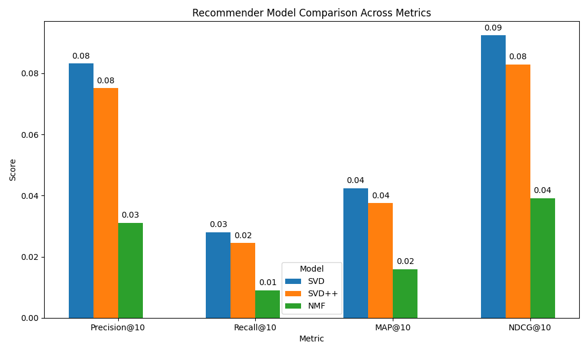

# MovieLens 1M Hybrid Movie Recommendation System

A modular, production-ready Python project for building a state-of-the-art movie recommender system using the MovieLens 1M dataset. Combines content-based (TF-IDF/cosine on genres, titles, year), collaborative filtering (SVD, SVD++, NMF using Surprise), and a hybrid model (weighted content+collaborative). Features a modern Streamlit UI, advanced evaluation metrics, model persistence, and visualization tools.

## Features
- **Content-based filtering:** TF-IDF and cosine similarity on genres, titles, and year
- **Collaborative filtering:** SVD, SVD++, NMF (Surprise library)
- **Hybrid model:** Weighted combination of content and collaborative recommenders
- **Streamlit web app:** Clean, client-facing UI for recommendations
- **Advanced metrics:** Precision@10, Recall@10, MAP@10, NDCG@10, RMSE
- **Model persistence:** Save/load models for reproducibility
- **Visualization:** Bar charts, latent factor histograms, and more
- **Testing:** Unified test script for all models and metrics
- **Docker-ready:** Easy containerization and deployment

## Demo

<div align="center">
  
  
  <br>
  <em>Left: Home screen with movie selection | Right: Personalized recommendations for User ID 1</em>
</div>

## Model Choices & Rationale

This project implements and combines several recommendation models, each chosen for their strengths and complementary properties. **Based on evaluation (MAP@10 and other metrics), SVD was found to be the best collaborative filtering model. The hybrid model used in the app combines content-based filtering with SVD.**

### Content-Based Filtering (TF-IDF + Cosine Similarity)
- **What it is:** Recommends movies based on their metadata (genres, title, year) using TF-IDF vectorization and cosine similarity.
- **Why chosen:** Interpretable, works for new/unrated movies (cold-start), leverages rich metadata, and complements collaborative filtering when user-item data is sparse.
- **Key hyperparameters:** `ngram_range`, `min_df`, `max_df`, `token_pattern` (TF-IDF vectorizer).
- **Evaluation:** Precision@k, Recall@k, MAP@k, NDCG@k (ranking metrics).
- **Strengths:** Cold-start for items, explainable recommendations.
- **Limitations:** Limited by metadata quality, cannot capture collaborative patterns.

### Collaborative Filtering (Matrix Factorization: SVD, SVD++, NMF)
- **What it is:** Learns latent user and item factors from the rating matrix. SVD and NMF decompose the matrix; SVD++ also uses implicit feedback.
- **Why chosen:** State-of-the-art for collaborative filtering, strong performance, interpretable latent factors, robust Surprise library implementations.
- **Key hyperparameters:** `n_factors`, `n_epochs`, `lr_all`, `reg_all`, `reg_pu`, `reg_qi`.
- **Evaluation:** RMSE (rating prediction), Precision@k, Recall@k, MAP@k, NDCG@k (ranking).
- **Strengths:** Captures user-item patterns, good for large/sparse data, factors can be visualized.
- **Limitations:** Cold-start for new users/items, SVD++ is slower, needs sufficient data.
- **Best model:** **SVD** was found to be the best collaborative filtering model in this project, based on MAP@10 and other ranking metrics.

### Hybrid Model (Weighted Content + Collaborative)
- **What it is:** Combines content-based and collaborative scores using a weighted sum (alpha) or learned regression.
- **Why chosen:** Leverages strengths of both approaches, robust to cold-start and sparse data, often outperforms pure models.
- **Key hyperparameters:** `alpha` (content/collaborative weighting), regression weights (optional).
- **Evaluation:** Precision@k, Recall@k, MAP@k, NDCG@k (ranking).
- **Strengths:** Robust, flexible, mitigates weaknesses of individual models.
- **Limitations:** More complex, requires both models, tuning needed.
- **In this project:** The hybrid model used in the app is a combination of the content-based model and the **SVD** collaborative model, as SVD was found to be the best performer.

---



<div align="center"><em>Comparison of model performance across ranking metrics (Precision@10, Recall@10, MAP@10, NDCG@10)</em></div>

---

## Project Structure
```
movie_recommender/
  data/           # Data loading and preprocessing
  models/         # Recommender models (content, collaborative, hybrid)
  app/            # Streamlit web app
  utils/          # Metrics and utilities
plots/            # Output plots
saved_models/     # Serialized model files
ml-1m/            # MovieLens 1M dataset (place here)
tools/
  visualization/  # Visualization scripts for model evaluation
    visualize_all_models.py
    visualize_best_model.py
tests/            # Unified test script
main.py           # Entrypoint (CLI)
requirements.txt  # Python dependencies
```

## Setup Instructions

### 1. Install Dependencies
```bash
pip install -r requirements.txt
```

### 2. Docker Setup (Alternative)
```bash
docker build -t movie-recommender .
docker run -p 8501:8501 movie-recommender
```
The app will be available at `http://localhost:8501`.

### 3. Download Dataset
- Place the `ml-1m` folder in the project root (next to `main.py`).
- Download from [GroupLens](https://grouplens.org/datasets/movielens/1m/).

## Usage

### Run the Streamlit Web App
```bash
PYTHONPATH=. streamlit run movie_recommender/app/webapp.py
```
- Or use the CLI:
```bash
python main.py --app
```

### Train or Evaluate Models (CLI)
```bash
python main.py --train      # Train all models
python main.py --evaluate   # Evaluate all models
```

### Run All Tests
```bash
python tests/test_recommender_accuracy.py
```

### Visualize Model Performance
```bash
python tools/visualization/visualize_all_models.py
python tools/visualization/visualize_best_model.py
```
- Plots are saved in the `plots/` folder with descriptive filenames.

## Key Modules
- **data/loader.py:** Data loading utilities
- **data/paths.py:** Robust, portable path management
- **models/content.py:** Content-based recommender (TF-IDF/cosine)
- **models/collaborative.py:** SVD, SVD++, NMF recommenders (Surprise)
- **models/hybrid.py:** Hybrid recommender (weighted content + collaborative)
- **utils/metrics.py:** Advanced evaluation metrics
- **app/webapp.py:** Streamlit UI (client-facing, hybrid-only)
- **tests/test_recommender_accuracy.py:** Unified test script for all models/metrics
- **tools/visualization/:** Visualization scripts for model evaluation
